# XDiscordUltimate Architecture Documentation

## Table of Contents

1. [System Overview](#system-overview)
2. [Architecture Patterns](#architecture-patterns)
3. [System Components](#system-components)
4. [Module System Architecture](#module-system-architecture)
5. [Database Design](#database-design)
6. [Discord Integration Architecture](#discord-integration-architecture)
7. [Event Flow Diagrams](#event-flow-diagrams)
8. [Component Interaction](#component-interaction)
9. [Deployment Architecture](#deployment-architecture)
10. [Security Architecture](#security-architecture)
11. [Scalability Considerations](#scalability-considerations)
12. [Technology Stack](#technology-stack)

---

## System Overview

XDiscordUltimate is a comprehensive Minecraft Spigot plugin that provides bidirectional integration between Minecraft servers and Discord. The system follows a modular architecture with clear separation of concerns, enabling easy extensibility and maintainability.

### Key Design Goals

1. **Modularity** - Each feature is a self-contained module
2. **Extensibility** - Easy to add new features via module system
3. **Reliability** - Graceful error handling and recovery
4. **Performance** - Async operations, connection pooling, caching
5. **Maintainability** - Clean code structure, clear API boundaries
6. **Configurability** - Highly configurable via YAML files
7. **Interoperability** - Integrates with popular plugins (LuckPerms, PlaceholderAPI, Vault)

---

## Architecture Patterns

### 1. Module Pattern
- **Implementation:** Base `Module` class with abstract methods
- **Purpose:** Encapsulates each feature into independent, self-contained unit
- **Benefits:**
  - Easy to enable/disable features
  - Clear separation of concerns
  - Simplifies testing and debugging
  - Allows selective feature loading

### 2. Manager Pattern
- **Implementation:** Central manager classes (ModuleManager, DiscordManager, DatabaseManager)
- **Purpose:** Centralized management of related components
- **Benefits:**
  - Single point of control
  - Simplified initialization
  - Better resource management
  - Consistent lifecycle management

### 3. Repository Pattern
- **Implementation:** DatabaseManager acts as data access layer
- **Purpose:** Abstract database operations from business logic
- **Benefits:**
  - Separation of data access logic
  - Database vendor abstraction
  - Easier testing with mock data
  - Centralized query optimization

### 4. Observer Pattern
- **Implementation:** Event listeners for Bukkit and Discord events
- **Purpose:** Loose coupling between components
- **Benefits:**
  - Easy to add new listeners
  - Decoupled event handling
  - Better testability
  - Flexible event routing

### 5. Dependency Injection
- **Implementation:** Plugin instance passed to all components
- **Purpose:** Inversion of control for dependencies
- **Benefits:**
  - Reduced coupling
  - Easier testing (can inject mocks)
  - Clear dependency relationships
  - Simplified configuration

---

## System Components

### High-Level Architecture Diagram


```mermaid
graph TB
    subgraph "Minecraft Server"
        MC[Spigot Server]
    end

    subgraph "XDiscordUltimate Plugin"
        MAIN[XDiscordUltimate Main Class]
        CONFIG[ConfigManager]
        MESSAGE[MessageManager]
        DATABASE[DatabaseManager]
        DISCORD[DiscordManager]
        MODULE_MGR[ModuleManager]
    end

    subgraph "Modules Layer"
        MOD1[ChatBridge Module]
        MOD2[Verification Module]
        MOD3[Tickets Module]
        MOD4[Moderation Module]
        MOD5[Server Logging Module]
        MOD6[Player Stats Module]
        MOD7[Server Status Module]
        MOD8[Admin Alerts Module]
        MOD9[Bot Console Module]
        MOD10[Announcements Module]
        MOD11[Booster Perks Module]
        MOD12[Welcome DM Module]
        MOD13[Leaderboard Module]
        MOD14[Activity Roles Module]
        MOD15[Voice Channels Module]
        MOD16[Economy Bridge Module]
    end

    subgraph "Discord Bot"
        JDA[JDA 5.0]
        DISCORD_EVENTS[Discord Events]
        SLASH_COMMANDS[Slash Commands]
        WEBHOOKS[Webhooks]
    end

    subgraph "External Systems"
        DB[(SQLite/MySQL/PostgreSQL)]
        LP[LuckPerms API]
        PAPI[PlaceholderAPI]
        VAULT[Vault API]
    end

    subgraph "Commands"
        CMD1[VerifyCommand]
        CMD2[SupportCommand]
        CMD3[ReportCommand]
        CMD4[AnnounceCommand]
        CMD5[HelpCommand]
        CMD6[StatsCommand]
        CMD7[XDiscordCommand]
    end

    subgraph "Event Listeners"
        LISTENER1[PlayerListener]
        LISTENER2[ChatListener]
        LISTENER3[ServerListener]
        LISTENER4[DiscordListener]
    end

    MAIN --> CONFIG
    MAIN --> MESSAGE
    MAIN --> DATABASE
    MAIN --> DISCORD
    MAIN --> MODULE_MGR
    MAIN --> CMD1
    MAIN --> CMD2
    MAIN --> CMD3
    MAIN --> CMD4
    MAIN --> CMD5
    MAIN --> CMD6
    MAIN --> CMD7
    MAIN --> LISTENER1
    MAIN --> LISTENER2
    MAIN --> LISTENER3
    MAIN --> LISTENER4

    MODULE_MGR --> MOD1
    MODULE_MGR --> MOD2
    MODULE_MGR --> MOD3
    MODULE_MGR --> MOD4
    MODULE_MGR --> MOD5
    MODULE_MGR --> MOD6
    MODULE_MGR --> MOD7
    MODULE_MGR --> MOD8
    MODULE_MGR --> MOD9
    MODULE_MGR --> MOD10
    MODULE_MGR --> MOD11
    MODULE_MGR --> MOD12
    MODULE_MGR --> MOD13
    MODULE_MGR --> MOD14
    MODULE_MGR --> MOD15
    MODULE_MGR --> MOD16

    DISCORD --> JDA
    JDA --> DISCORD_EVENTS
    JDA --> SLASH_COMMANDS
    JDA --> WEBHOOKS

    DATABASE --> DB
    MAIN --> LP
    MAIN --> PAPI
    MAIN --> VAULT

    MC --> MAIN
```

---

## Module System Architecture

### Module Lifecycle

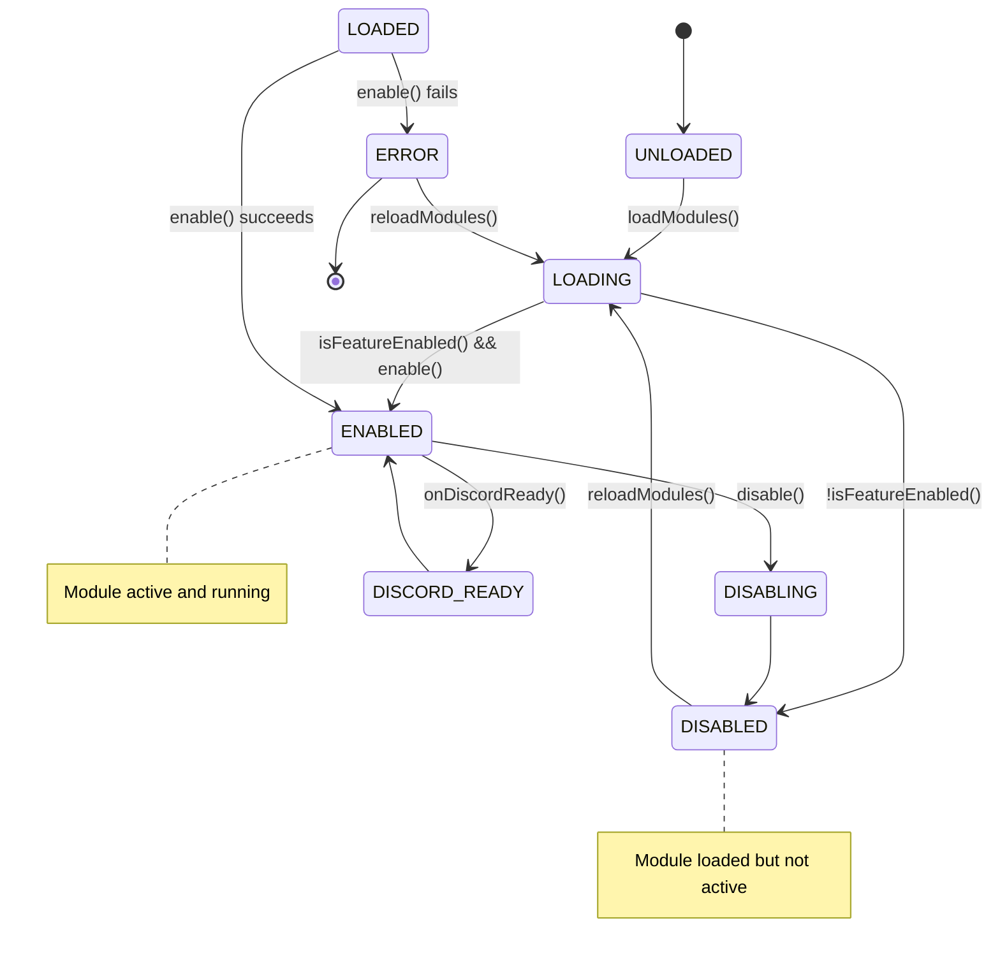
```mermaid
stateDiagram-v2
    [*] --> UNLOADED

    UNLOADED --> LOADING : loadModules()
    LOADING --> ENABLED : isFeatureEnabled() && enable()
    LOADING --> DISABLED : !isFeatureEnabled()
    LOADED --> ENABLED : enable() succeeds
    LOADED --> ERROR : enable() fails
    ENABLED --> DISABLING : disable()
    DISABLING --> DISABLED
    ENABLED --> DISCORD_READY : onDiscordReady()
    DISCORD_READY --> ENABLED
    DISABLED --> LOADING : reloadModules()
    ERROR --> LOADING : reloadModules()
    ERROR --> [*]

    note right of DISABLED
        Module loaded but not active
    end note

    note right of ENABLED
        Module active and running
    end note
```

### Module Structure

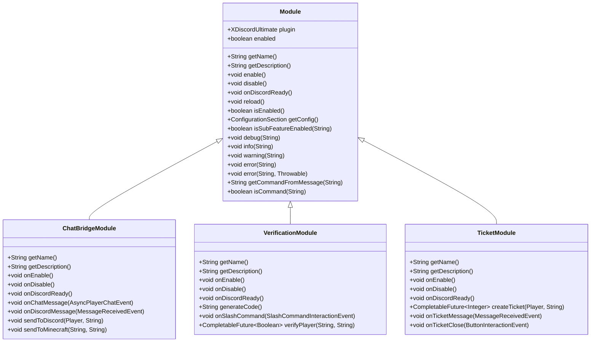
```mermaid
classDiagram
    class Module {
        +XDiscordUltimate plugin
        +boolean enabled
        +String getName()
        +String getDescription()
        +void enable()
        +void disable()
        +void onDiscordReady()
        +void reload()
        +boolean isEnabled()
        +ConfigurationSection getConfig()
        +boolean isSubFeatureEnabled(String)
        +void debug(String)
        +void info(String)
        +void warning(String)
        +void error(String)
        +void error(String, Throwable)
        +String getCommandFromMessage(String)
        +boolean isCommand(String)
    }

    class ChatBridgeModule {
        +String getName()
        +String getDescription()
        +void onEnable()
        +void onDisable()
        +void onDiscordReady()
        +void onChatMessage(AsyncPlayerChatEvent)
        +void onDiscordMessage(MessageReceivedEvent)
        +void sendToDiscord(Player, String)
        +void sendToMinecraft(String, String)
    }

    class VerificationModule {
        +String getName()
        +String getDescription()
        +void onEnable()
        +void onDisable()
        +void onDiscordReady()
        +String generateCode()
        +void onSlashCommand(SlashCommandInteractionEvent)
        +CompletableFuture~Boolean~ verifyPlayer(String, String)
    }

    class TicketModule {
        +String getName()
        +String getDescription()
        +void onEnable()
        +void onDisable()
        +void onDiscordReady()
        +CompletableFuture~Integer~ createTicket(Player, String)
        +void onTicketMessage(MessageReceivedEvent)
        +void onTicketClose(ButtonInteractionEvent)
    }

    Module <|-- ChatBridgeModule
    Module <|-- VerificationModule
    Module <|-- TicketModule
```

### Module Dependencies

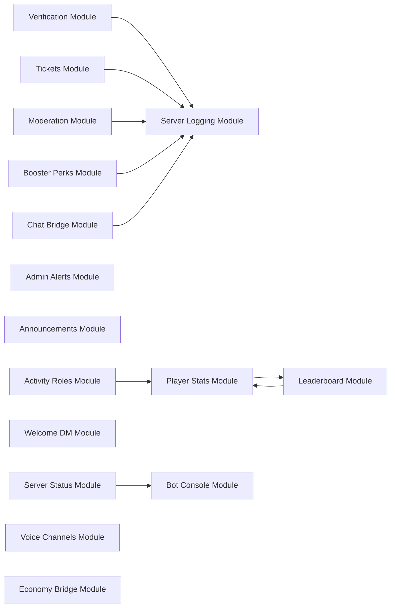
```mermaid
graph LR
    CHAT[Chat Bridge Module]
    VERIFY[Verification Module]
    TICKET[Tickets Module]
    MOD[Moderation Module]
    LOG[Server Logging Module]
    STATS[Player Stats Module]
    STATUS[Server Status Module]
    ALERT[Admin Alerts Module]
    CONSOLE[Bot Console Module]
    ANNOUNCE[Announcements Module]
    BOOST[Booster Perks Module]
    WELCOME[Welcome DM Module]
    LEADER[Leaderboard Module]
    ACTIVITY[Activity Roles Module]
    VOICE[Voice Channels Module]
    ECONOMY[Economy Bridge Module]

    VERIFY --> LOG
    TICKET --> LOG
    MOD --> LOG
    BOOST --> LOG
    STATS --> LEADER
    ACTIVITY --> STATS
    LEADER --> STATS
    STATUS --> CONSOLE
    CHAT --> LOG
```

---

## Database Design

### Entity Relationship Diagram

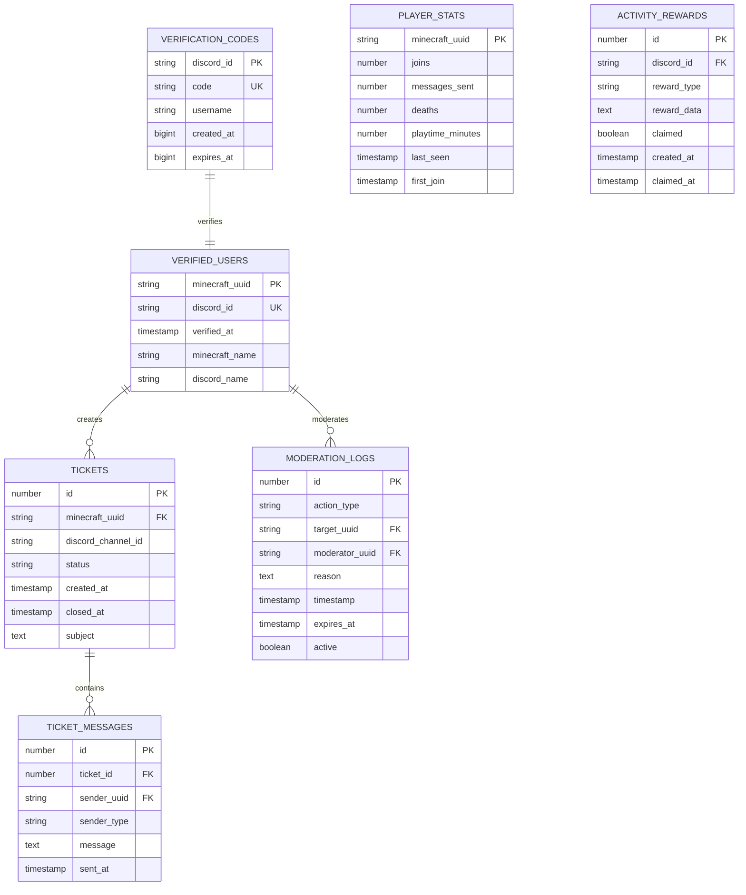
```mermaid
erDiagram
    VERIFIED_USERS {
        string minecraft_uuid PK
        string discord_id UK
        timestamp verified_at
        string minecraft_name
        string discord_name
    }

    VERIFICATION_CODES {
        string discord_id PK
        string code UK
        string username
        bigint created_at
        bigint expires_at
    }

    TICKETS {
        number id PK
        string minecraft_uuid FK
        string discord_channel_id
        string status
        timestamp created_at
        timestamp closed_at
        text subject
    }

    TICKET_MESSAGES {
        number id PK
        number ticket_id FK
        string sender_uuid FK
        string sender_type
        text message
        timestamp sent_at
    }

    MODERATION_LOGS {
        number id PK
        string action_type
        string target_uuid FK
        string moderator_uuid FK
        text reason
        timestamp timestamp
        timestamp expires_at
        boolean active
    }

    PLAYER_STATS {
        string minecraft_uuid PK
        number joins
        number messages_sent
        number deaths
        number playtime_minutes
        timestamp last_seen
        timestamp first_join
    }

    ACTIVITY_REWARDS {
        number id PK
        string discord_id FK
        string reward_type
        text reward_data
        boolean claimed
        timestamp created_at
        timestamp claimed_at
    }

    VERIFIED_USERS ||--o{ TICKETS : creates
    VERIFIED_USERS ||--o{ MODERATION_LOGS : moderates
    TICKETS ||--o{ TICKET_MESSAGES : contains
    VERIFICATION_CODES ||--|| VERIFIED_USERS : verifies
```

### Database Connection Architecture

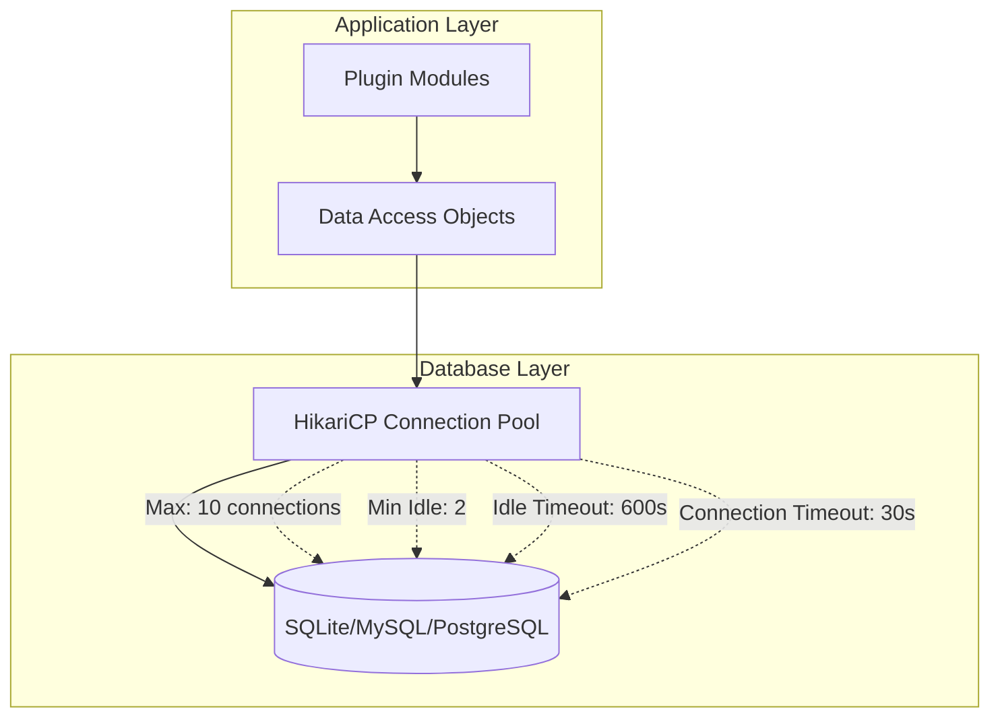
```mermaid
graph TB
    subgraph "Application Layer"
        APP[Plugin Modules]
        DAO[Data Access Objects]
    end

    subgraph "Database Layer"
        POOL[HikariCP Connection Pool]
        DB[(SQLite/MySQL/PostgreSQL)]
    end

    APP --> DAO
    DAO --> POOL
    POOL --> DB

    POOL -.-> |Max: 10 connections| DB
    POOL -.-> |Min Idle: 2| DB
    POOL -.-> |Idle Timeout: 600s| DB
    POOL -.-> |Connection Timeout: 30s| DB
```

### Database Schema Details

#### verified_users Table

**Purpose:** Maps Minecraft accounts to Discord accounts for verification system

| Column | Type | Constraints | Index |
|--------|------|-------------|-------|
| minecraft_uuid | VARCHAR(36) | PRIMARY KEY | PK |
| discord_id | VARCHAR(20) | NOT NULL, UNIQUE | INDEX |
| verified_at | TIMESTAMP | DEFAULT CURRENT_TIMESTAMP | - |
| minecraft_name | VARCHAR(16) | - | - |
| discord_name | VARCHAR(32) | - | - |

**Indexes:**
- PRIMARY KEY on minecraft_uuid
- UNIQUE on discord_id
- INDEX on discord_id (for lookup by Discord)

#### verification_codes Table

**Purpose:** Temporary storage for verification codes

| Column | Type | Constraints | Index |
|--------|------|-------------|-------|
| discord_id | VARCHAR(20) | PRIMARY KEY | PK |
| code | VARCHAR(10) | NOT NULL, UNIQUE | INDEX |
| username | VARCHAR(16) | - | - |
| created_at | BIGINT | NOT NULL | INDEX |
| expires_at | BIGINT | NOT NULL | INDEX |

**Indexes:**
- PRIMARY KEY on discord_id
- UNIQUE on code
- INDEX on expires_at (for cleanup)

#### tickets Table

**Purpose:** Support ticket management

| Column | Type | Constraints | Index |
|--------|------|-------------|-------|
| id | INTEGER | PRIMARY KEY, AUTO_INCREMENT | PK |
| minecraft_uuid | VARCHAR(36) | NOT NULL, FK | INDEX |
| discord_channel_id | VARCHAR(20) | - | - |
| status | VARCHAR(20) | DEFAULT 'OPEN' | INDEX |
| created_at | TIMESTAMP | DEFAULT CURRENT_TIMESTAMP | - |
| closed_at | TIMESTAMP | NULL | - |
| subject | TEXT | - | - |

**Indexes:**
- PRIMARY KEY on id
- INDEX on minecraft_uuid
- INDEX on status

#### player_stats Table

**Purpose:** Player statistics tracking

| Column | Type | Constraints | Index |
|--------|------|-------------|-------|
| minecraft_uuid | VARCHAR(36) | PRIMARY KEY | PK |
| joins | INTEGER | DEFAULT 0 | - |
| messages_sent | INTEGER | DEFAULT 0 | - |
| deaths | INTEGER | DEFAULT 0 | - |
| playtime_minutes | INTEGER | DEFAULT 0 | INDEX |
| last_seen | TIMESTAMP | DEFAULT CURRENT_TIMESTAMP | - |
| first_join | TIMESTAMP | DEFAULT CURRENT_TIMESTAMP | - |

**Indexes:**
- PRIMARY KEY on minecraft_uuid
- INDEX on playtime_minutes (for leaderboards)

---

## Discord Integration Architecture

### Discord Bot Architecture

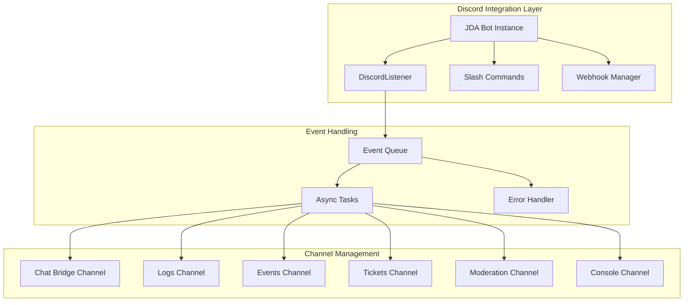
```mermaid
graph TB
    subgraph "Discord Integration Layer"
        BOT[JDA Bot Instance]
        LISTENER[DiscordListener]
        COMMANDS[Slash Commands]
        WEBHOOK[Webhook Manager]
    end

    subgraph "Event Handling"
        EVENTS[Event Queue]
        ASYNC_TASKS[Async Tasks]
        ERROR_HANDLER[Error Handler]
    end

    subgraph "Channel Management"
        CHAT_CHANNEL[Chat Bridge Channel]
        LOG_CHANNEL[Logs Channel]
        EVENT_CHANNEL[Events Channel]
        TICKET_CHANNEL[Tickets Channel]
        MOD_CHANNEL[Moderation Channel]
        CONSOLE_CHANNEL[Console Channel]
    end

    BOT --> LISTENER
    BOT --> COMMANDS
    BOT --> WEBHOOK

    LISTENER --> EVENTS
    EVENTS --> ASYNC_TASKS
    EVENTS --> ERROR_HANDLER

    ASYNC_TASKS --> CHAT_CHANNEL
    ASYNC_TASKS --> LOG_CHANNEL
    ASYNC_TASKS --> EVENT_CHANNEL
    ASYNC_TASKS --> TICKET_CHANNEL
    ASYNC_TASKS --> MOD_CHANNEL
    ASYNC_TASKS --> CONSOLE_CHANNEL
```

### JDA Configuration

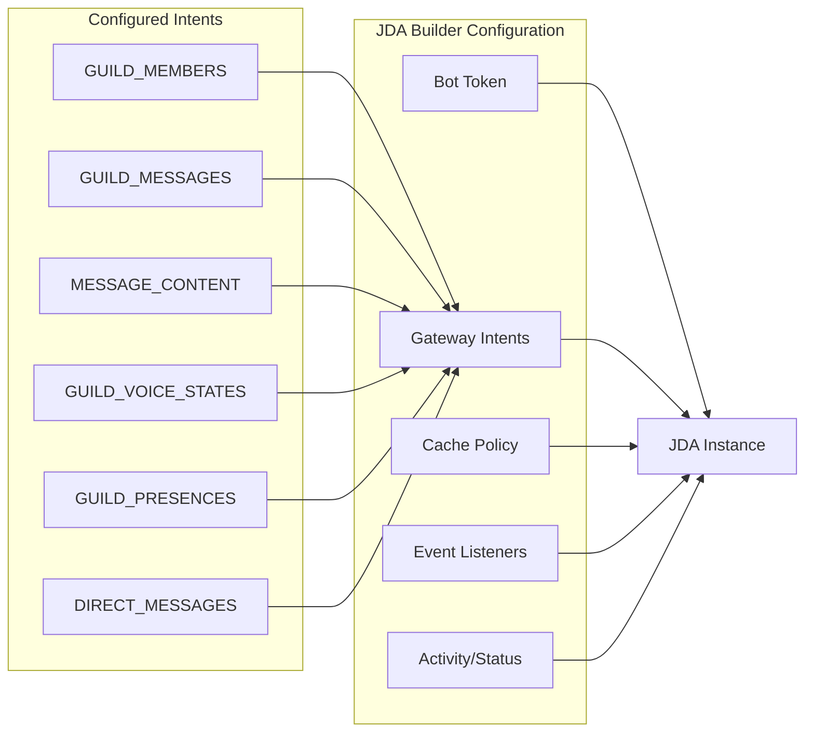
```mermaid
graph LR
    subgraph "JDA Builder Configuration"
        TOKEN[Bot Token]
        INTENTS[Gateway Intents]
        CACHE[Cache Policy]
        LISTENERS[Event Listeners]
        ACTIVITY[Activity/Status]
    end

    subgraph "Configured Intents"
        GUILD_MEMBERS[GUILD_MEMBERS]
        GUILD_MESSAGES[GUILD_MESSAGES]
        MESSAGE_CONTENT[MESSAGE_CONTENT]
        GUILD_VOICE_STATES[GUILD_VOICE_STATES]
        GUILD_PRESENCES[GUILD_PRESENCES]
        DIRECT_MESSAGES[DIRECT_MESSAGES]
    end

    TOKEN --> BOT[JDA Instance]
    INTENTS --> BOT
    CACHE --> BOT
    LISTENERS --> BOT
    ACTIVITY --> BOT

    GUILD_MEMBERS --> INTENTS
    GUILD_MESSAGES --> INTENTS
    MESSAGE_CONTENT --> INTENTS
    GUILD_VOICE_STATES --> INTENTS
    GUILD_PRESENCES --> INTENTS
    DIRECT_MESSAGES --> INTENTS
```

### Message Flow Architecture

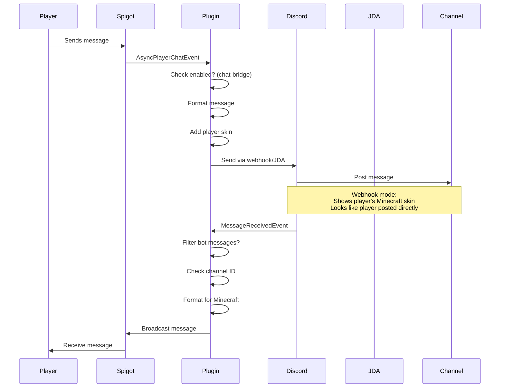
```mermaid
sequenceDiagram
    participant Player
    participant Spigot
    participant Plugin
    participant Discord
    participant JDA
    participant Channel

    Player->>Spigot: Sends message
    Spigot->>Plugin: AsyncPlayerChatEvent
    Plugin->>Plugin: Check enabled? (chat-bridge)
    Plugin->>Plugin: Format message
    Plugin->>Plugin: Add player skin
    Plugin->>Discord: Send via webhook/JDA
    Discord->>Channel: Post message

    Note over Discord,Channel: Webhook mode:<br/>Shows player's Minecraft skin<br/>Looks like player posted directly

    Discord->>Plugin: MessageReceivedEvent
    Plugin->>Plugin: Filter bot messages?
    Plugin->>Plugin: Check channel ID
    Plugin->>Plugin: Format for Minecraft
    Plugin->>Spigot: Broadcast message
    Spigot->>Player: Receive message
```

---

## Event Flow Diagrams

### Player Join Event Flow

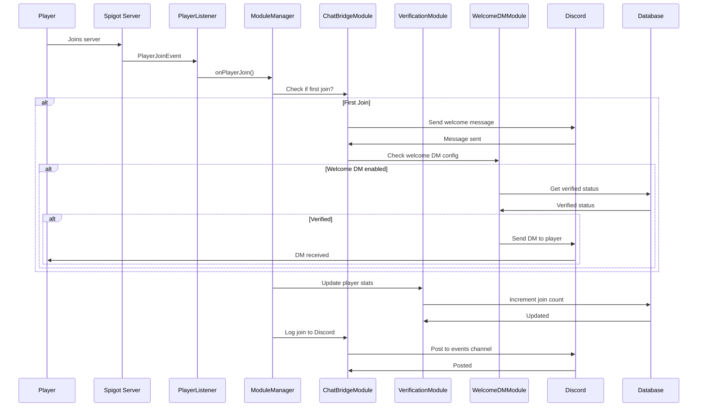
```mermaid
sequenceDiagram
    participant P as Player
    participant S as Spigot Server
    participant L as PlayerListener
    participant M as ModuleManager
    participant CBM as ChatBridgeModule
    participant V as VerificationModule
    participant W as WelcomeDMModule
    participant D as Discord
    participant DB as Database

    P->>S: Joins server
    S->>L: PlayerJoinEvent
    L->>M: onPlayerJoin()
    M->>CBM: Check if first join?
    alt First Join
        CBM->>D: Send welcome message
        D->>CBM: Message sent
        CBM->>W: Check welcome DM config
        alt Welcome DM enabled
            W->>DB: Get verified status
            DB->>W: Verified status
            alt Verified
                W->>D: Send DM to player
                D->>P: DM received
            end
        end
    end
    M->>V: Update player stats
    V->>DB: Increment join count
    DB->>V: Updated
    M->>CBM: Log join to Discord
    CBM->>D: Post to events channel
    D->>CBM: Posted
```

### Verification Flow

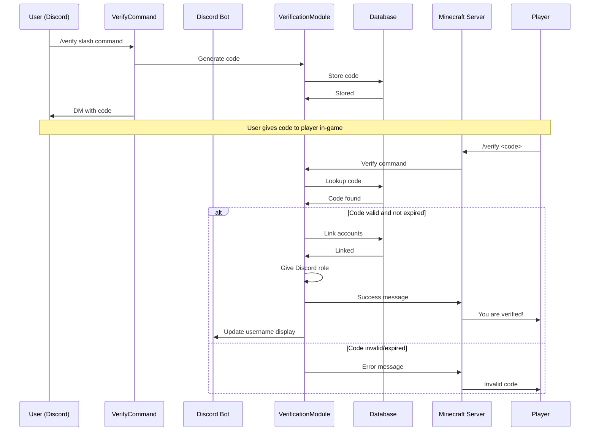
```mermaid
sequenceDiagram
    participant U as User (Discord)
    participant CMD as VerifyCommand
    participant D as Discord Bot
    participant VM as VerificationModule
    participant DB as Database
    participant M as Minecraft Server
    participant P as Player

    U->>CMD: /verify slash command
    CMD->>VM: Generate code
    VM->>DB: Store code
    DB->>VM: Stored
    CMD->>U: DM with code

    Note over U,P: User gives code to player in-game

    P->>M: /verify <code>
    M->>VM: Verify command
    VM->>DB: Lookup code
    DB->>VM: Code found
    alt Code valid and not expired
        VM->>DB: Link accounts
        DB->>VM: Linked
        VM->>VM: Give Discord role
        VM->>M: Success message
        M->>P: You are verified!
        VM->>D: Update username display
    else Code invalid/expired
        VM->>M: Error message
        M->>P: Invalid code
    end
```

### Support Ticket Flow

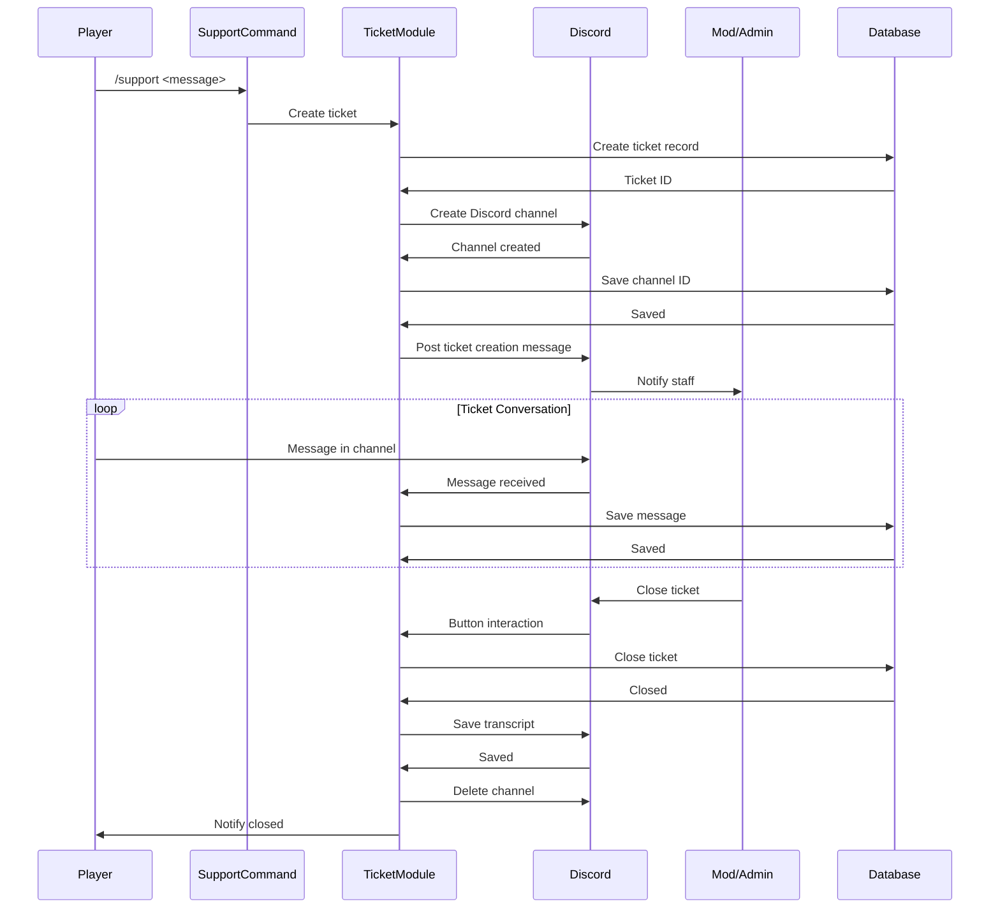
```mermaid
sequenceDiagram
    participant P as Player
    participant CMD as SupportCommand
    participant T as TicketModule
    participant D as Discord
    participant M as Mod/Admin
    participant DB as Database

    P->>CMD: /support <message>
    CMD->>T: Create ticket
    T->>DB: Create ticket record
    DB->>T: Ticket ID
    T->>D: Create Discord channel
    D->>T: Channel created
    T->>DB: Save channel ID
    DB->>T: Saved
    T->>D: Post ticket creation message
    D->>M: Notify staff

    loop Ticket Conversation
        P->>D: Message in channel
        D->>T: Message received
        T->>DB: Save message
        DB->>T: Saved
    end

    M->>D: Close ticket
    D->>T: Button interaction
    T->>DB: Close ticket
    DB->>T: Closed
    T->>D: Save transcript
    D->>T: Saved
    T->>D: Delete channel
    T->>P: Notify closed
```

### Chat Bridge Flow

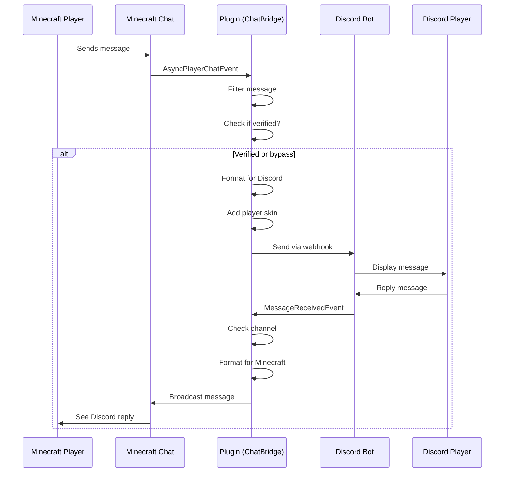
```mermaid
sequenceDiagram
    participant MP as Minecraft Player
    participant MC as Minecraft Chat
    participant PM as Plugin (ChatBridge)
    participant DC as Discord Bot
    participant DP as Discord Player

    MP->>MC: Sends message
    MC->>PM: AsyncPlayerChatEvent
    PM->>PM: Filter message
    PM->>PM: Check if verified?
    alt Verified or bypass
        PM->>PM: Format for Discord
        PM->>PM: Add player skin
        PM->>DC: Send via webhook
        DC->>DP: Display message

        DP->>DC: Reply message
        DC->>PM: MessageReceivedEvent
        PM->>PM: Check channel
        PM->>PM: Format for Minecraft
        PM->>MC: Broadcast message
        MC->>MP: See Discord reply
    end
```

---

## Component Interaction

### Initialization Sequence

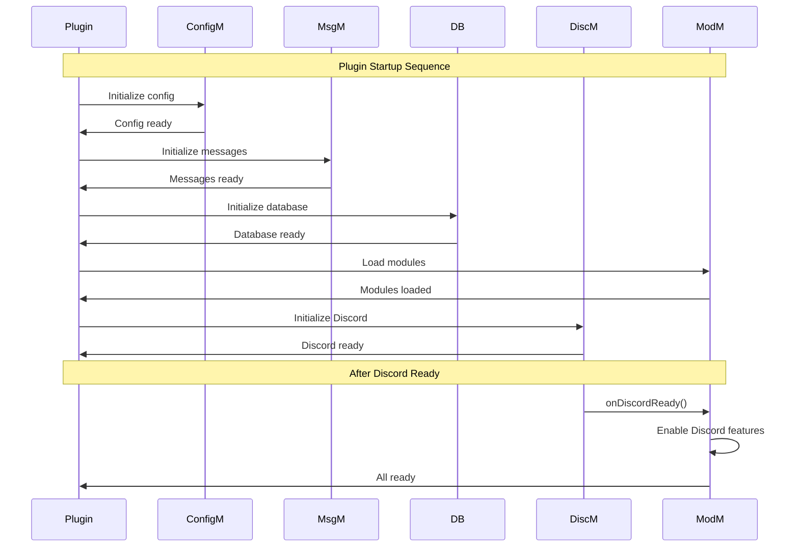
```mermaid
sequenceDiagram
    participant Plugin
    participant ConfigM
    participant MsgM
    participant DB
    participant DiscM
    participant ModM

    Note over Plugin,ModM: Plugin Startup Sequence

    Plugin->>ConfigM: Initialize config
    ConfigM->>Plugin: Config ready
    Plugin->>MsgM: Initialize messages
    MsgM->>Plugin: Messages ready
    Plugin->>DB: Initialize database
    DB->>Plugin: Database ready
    Plugin->>ModM: Load modules
    ModM->>Plugin: Modules loaded
    Plugin->>DiscM: Initialize Discord
    DiscM->>Plugin: Discord ready
    Note over Plugin,ModM: After Discord Ready
    DiscM->>ModM: onDiscordReady()
    ModM->>ModM: Enable Discord features
    ModM->>Plugin: All ready
```

### Module Dependency Graph

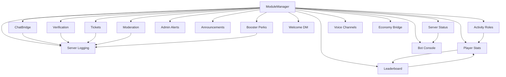
```mermaid
graph TD
    A[ModuleManager] --> B[ChatBridge]
    A --> C[Verification]
    A --> D[Tickets]
    A --> E[Moderation]
    A --> F[Server Logging]
    A --> G[Player Stats]
    A --> H[Server Status]
    A --> I[Admin Alerts]
    A --> J[Bot Console]
    A --> K[Announcements]
    A --> L[Booster Perks]
    A --> M[Welcome DM]
    A --> N[Leaderboard]
    A --> O[Activity Roles]
    A --> P[Voice Channels]
    A --> Q[Economy Bridge]

    B --> F
    C --> F
    D --> F
    E --> F
    L --> F
    G --> N
    O --> G
    N --> G
    H --> J
```

### Data Flow Architecture

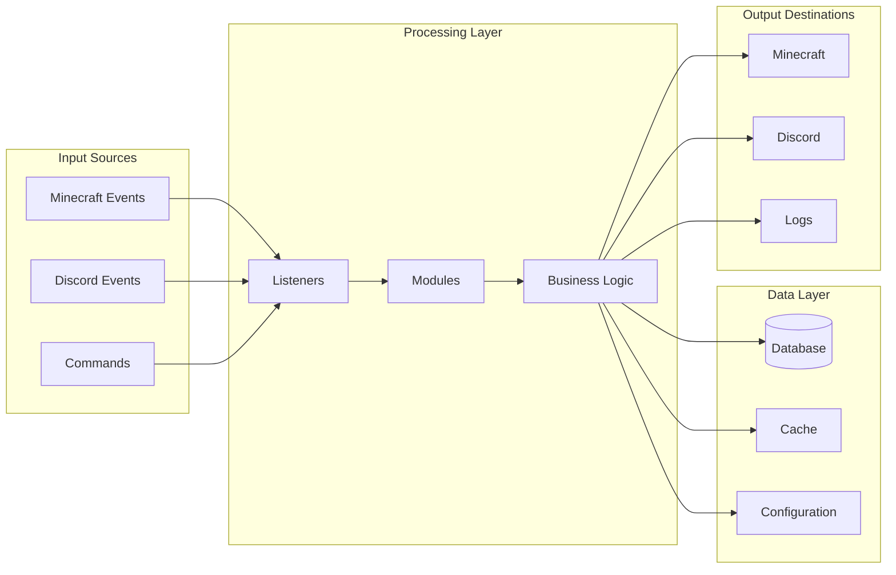
```mermaid
graph LR
    subgraph "Input Sources"
        MC[Minecraft Events]
        DC[Discord Events]
        CMD[Commands]
    end

    subgraph "Processing Layer"
        LIST[Listeners]
        MODS[Modules]
        LOGIC[Business Logic]
    end

    subgraph "Data Layer"
        DB[(Database)]
        CACHE[Cache]
        CONFIG[Configuration]
    end

    subgraph "Output Destinations"
        MINECRAFT[Minecraft]
        DISCORD[Discord]
        LOGS[Logs]
    end

    MC --> LIST
    DC --> LIST
    CMD --> LIST

    LIST --> MODS
    MODS --> LOGIC
    LOGIC --> DB
    LOGIC --> CACHE
    LOGIC --> CONFIG

    LOGIC --> MINECRAFT
    LOGIC --> DISCORD
    LOGIC --> LOGS
```

---

## Deployment Architecture

### Server Deployment Diagram

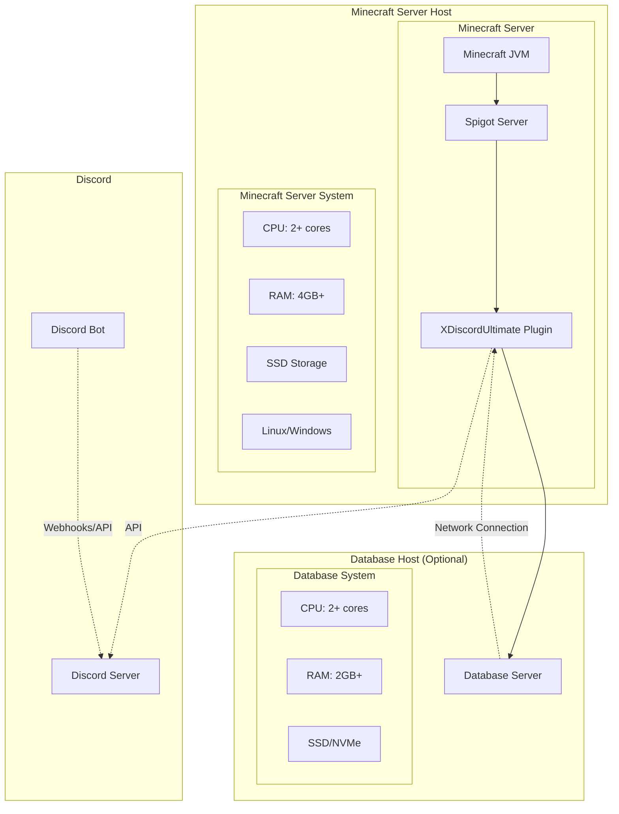
```mermaid
graph TB
    subgraph "Minecraft Server Host"
        subgraph "Minecraft Server"
            JVM[Minecraft JVM]
            SPIGOT[Spigot Server]
            PLUGIN[XDiscordUltimate Plugin]
        end

        subgraph "Minecraft Server System"
            CPU[CPU: 2+ cores]
            RAM[RAM: 4GB+]
            DISK[SSD Storage]
            OS[Linux/Windows]
        end
    end

    subgraph "Database Host (Optional)"
        DB[Database Server]
        subgraph "Database System"
            DB_CPU[CPU: 2+ cores]
            DB_RAM[RAM: 2GB+]
            DB_DISK[SSD/NVMe]
        end
    end

    subgraph "Discord"
        DISCORD[Discord Server]
        BOT[Discord Bot]
    end

    PLUGIN --> DB
    SPIGOT --> PLUGIN
    JVM --> SPIGOT

    DB -.->|Network Connection| PLUGIN
    PLUGIN -.->|API| DISCORD
    BOT -.->|Webhooks/API| DISCORD
```

### Configuration Deployment

```mermaid
graph TB
    subgraph "Deployment Package"
        JAR[XDiscordUltimate-1.1.0.jar]
        CONFIG_TPL[config.yml template]
        MSG_TPL[messages.yml template]
        PLUGIN_YML[plugin.yml]
    end

    subgraph "Generated Files (First Run)"
        CONFIG[config.yml]
        MSG[messages.yml]
        DB_FILE[data.db (if SQLite)]
    end

    subgraph "User Configuration"
        USER_CONFIG[Edited config.yml]
        USER_MSG[Custom messages.yml]
    end

    JAR --> CONFIG_TPL
    JAR --> MSG_TPL

    CONFIG_TPL --> CONFIG
    MSG_TPL --> MSG

    USER_CONFIG -.-> CONFIG
    USER_MSG -.-> MSG
```

---

## Security Architecture

### Security Layers

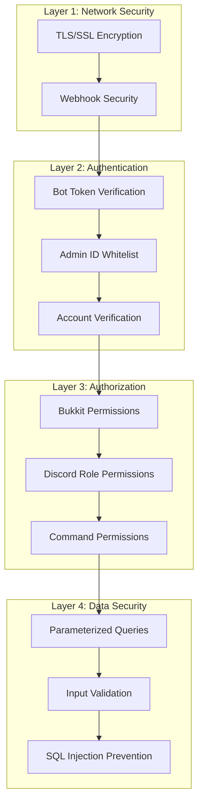
```mermaid
graph TB
    subgraph "Layer 1: Network Security"
        TLS[TLS/SSL Encryption]
        WEBHOOK[Webhook Security]
    end

    subgraph "Layer 2: Authentication"
        BOT_TOKEN[Bot Token Verification]
        ADMIN_IDS[Admin ID Whitelist]
        VERIFICATION[Account Verification]
    end

    subgraph "Layer 3: Authorization"
        PERMISSIONS[Bukkit Permissions]
        DISCORD_PERMS[Discord Role Permissions]
        COMMAND_PERMS[Command Permissions]
    end

    subgraph "Layer 4: Data Security"
        SQL_PARAM[Parameterized Queries]
        INPUT_VALID[Input Validation]
        SQL_INJECTION[SQL Injection Prevention]
    end

    TLS --> WEBHOOK
    WEBHOOK --> BOT_TOKEN
    BOT_TOKEN --> ADMIN_IDS
    ADMIN_IDS --> VERIFICATION

    VERIFICATION --> PERMISSIONS
    PERMISSIONS --> DISCORD_PERMS
    DISCORD_PERMS --> COMMAND_PERMS

    COMMAND_PERMS --> SQL_PARAM
    SQL_PARAM --> INPUT_VALID
    INPUT_VALID --> SQL_INJECTION
```

### Verification Security

1. **Code Generation**
   - Random 6-character alphanumeric codes
   - Stored securely in database
   - Expire after configurable time (default 5 minutes)
   - One-time use only

2. **Account Linking**
   - Bidirectional mapping (UUID ↔ Discord ID)
   - Prevent duplicate linking
   - Update usernames on verification

3. **Protection Against**
   - SQL injection (parameterized queries)
   - Replay attacks (code expiry)
   - Unauthorized verification (permission checks)
   - Data corruption (transaction isolation)

### Permission Model

```mermaid
graph TD
    ROOT[xdiscord.*] --> A[xdiscord.admin]
    ROOT --> B[xdiscord.announce]
    ROOT --> C[xdiscord.console]
    ROOT --> D[xdiscord.verify]
    ROOT --> E[xdiscord.support]
    ROOT --> F[xdiscord.report]
    ROOT --> G[xdiscord.bypass.verification]
    ROOT --> H[xdiscord.bypass.filter]

    A --> A1[/xd reload]
    A --> A2[/xd status]
    A --> A3[/xd modules]

    B --> B1[/announce]

    C --> C1[!console command]

    E --> E1[/support]

    F --> F1[/report player reason]

    D --> D1[/verify <code>]
```

---

## Scalability Considerations

### Database Scalability

**Current Implementation:**
- HikariCP connection pooling (max 10 connections)
- Async database operations using CompletableFuture
- Optimized queries with indexes
- Database-agnostic (SQLite, MySQL, PostgreSQL)

**Scalability Recommendations:**

1. **For Small Servers (1-50 players)**
   - SQLite is sufficient
   - Default connection pool is adequate
   - No changes needed

2. **For Medium Servers (50-200 players)**
   - Consider MySQL or PostgreSQL
   - Increase connection pool size to 15-20
   - Monitor slow queries

3. **For Large Servers (200+ players)**
   - Use dedicated MySQL/PostgreSQL server
   - Tune connection pool (20-30 connections)
   - Enable query caching
   - Consider read replicas

4. **For Very Large Servers (500+ players)**
   - Implement database sharding
   - Use caching layer (Redis)
   - Consider micro-services architecture
   - Implement horizontal scaling

### Discord Rate Limits

**JDA Rate Limit Management:**
- JDA handles rate limits automatically
- Respect Retry-After headers
- Queue messages during rate limit
- Batch operations when possible

**Best Practices:**
- Avoid rapid-fire message sending
- Use webhooks for chat bridge (better rate limit handling)
- Cache channel lookups
- Use bulk operations for role updates

### Minecraft Server Scalability

**Threading Model:**
- Discord operations on separate threads (async)
- Database operations on separate threads
- Event processing on main server thread
- Config reloads on main server thread

**Performance Optimization:**
- Use async for all blocking operations
- Cache frequently accessed data
- Use scheduled tasks for periodic operations
- Limit webhook message rate
- Clean up expired data regularly

---

## Technology Stack

### Core Technologies

| Category | Technology | Version | Purpose |
|----------|-----------|---------|---------|
| **Minecraft Server** | Spigot/Paper API | 1.16.5-R0.1+ | Minecraft server integration |
| **Java Runtime** | OpenJDK | 17+ | Runtime environment |
| **Discord Integration** | JDA | 5.0.0-beta.18 | Discord API wrapper |
| **Build Tool** | Gradle | 7.0+ | Build automation |
| **Shadow Plugin** | Gradle Shadow | 8.3.0 | Uber-JAR creation |

### Database Technologies

| Database | Driver | Version | Notes |
|----------|--------|---------|-------|
| **SQLite** | sqlite-jdbc | 3.42.0.0 | Default, embedded |
| **MySQL** | mysql-connector-j | 8.0.33 | Production recommended |
| **PostgreSQL** | postgresql | 42.6.0 | Alternative option |

### Connection Pooling

| Component | Library | Version | Purpose |
|-----------|---------|---------|---------|
| **Connection Pool** | HikariCP | 5.0.1 | Database connection pool |

### HTTP Client

| Component | Library | Version | Purpose |
|-----------|---------|---------|---------|
| **HTTP Client** | OkHttp | 4.10.0 | Webhook and API requests |

### JSON Processing

| Component | Library | Version | Purpose |
|-----------|---------|---------|---------|
| **JSON** | Gson | 2.10.1 | JSON serialization/deserialization |

### Logging

| Component | Library | Version | Purpose |
|-----------|---------|---------|---------|
| **Logging API** | SLF4J | 2.0.9 | Logging facade |
| **Implementation** | Logback | 1.4.11 | Logging implementation |
| **Alternative** | Log4j2 | 2.17.1 | Alternative logging |

### Optional Dependencies

| Plugin | Version | Purpose | Integration |
|--------|---------|---------|-------------|
| **LuckPerms** | 5.4+ | Permission system | Prefix/suffix, groups |
| **PlaceholderAPI** | 2.11.3+ | Placeholder expansion | Custom placeholders |
| **Vault** | 1.7+ | Economy API | Future economy features |

---

## Extension Points

### Creating Custom Modules

1. **Extend the Module class**
```java
public class CustomModule extends Module {
    public CustomModule(XDiscordUltimate plugin) {
        super(plugin);
    }

    @Override
    public String getName() {
        return "Custom Module";
    }

    @Override
    public String getDescription() {
        return "A custom module for custom functionality";
    }

    @Override
    protected void onEnable() {
        // Module initialization
    }

    @Override
    protected void onDisable() {
        // Cleanup resources
    }
}
```

2. **Register in ModuleManager**
```java
registerModule("custom-module", new CustomModule(plugin));
```

3. **Add configuration**
```yaml
features:
  custom-module:
    enabled: true
    # Custom config options
```

### Database Extensions

1. **Add table creation**
```java
private void createTables() throws SQLException {
    String customTable = "CREATE TABLE IF NOT EXISTS custom_data (" +
        "id INTEGER PRIMARY KEY," +
        "data TEXT" +
        ")";
    // Execute creation
}
```

2. **Add repository methods**
```java
public CompletableFuture<Void> saveCustomData(int id, String data) {
    return executeAsync(() -> {
        String sql = "INSERT INTO custom_data (id, data) VALUES (?, ?)";
        try (PreparedStatement stmt = conn.prepareStatement(sql)) {
            stmt.setInt(1, id);
            stmt.setString(2, data);
            stmt.executeUpdate();
        }
        return null;
    });
}
```

### Custom Commands

1. **Implement CommandExecutor**
```java
public class CustomCommand implements CommandExecutor, TabCompleter {
    @Override
    public boolean onCommand(CommandSender sender, Command cmd, String label, String[] args) {
        // Command logic
        return true;
    }

    @Override
    public List<String> onTabComplete(CommandSender sender, Command cmd, String alias, String[] args) {
        // Tab completion logic
        return null;
    }
}
```

2. **Register in onEnable()**
```java
getCommand("custom").setExecutor(new CustomCommand(this));
```

---

## Monitoring and Debugging

### Logging Levels

1. **INFO** - Normal operations
2. **WARNING** - Recoverable errors, missing optional dependencies
3. **SEVERE** - Critical errors, failed initialization
4. **DEBUG** - Detailed debug information (only when enabled)

### Debug Mode

Enable debug mode in config:
```yaml
general:
  debug: true
```

This will:
- Log all database operations
- Log Discord API interactions
- Log module lifecycle events
- Log configuration loading

### Metrics

The plugin includes BStats integration:
- Plugin usage statistics
- Anonymous metrics (disabled by default)
- Can be disabled in config

### Health Checks

1. **Discord Connection**
   - Check if bot is ready
   - Verify guild connection
   - Check channel accessibility

2. **Database Health**
   - Connection pool status
   - Query performance
   - Connection errors

3. **Module Status**
   - Enabled/disabled modules
   - Module-specific health checks
   - Configuration validation

---

## Future Architecture Considerations

### Microservices Migration Path

For very large deployments, consider splitting into:

1. **Minecraft Plugin** - Event collection only
2. **Discord Bot Service** - Independent microservice
3. **API Gateway** - REST API for communication
4. **Database Service** - Centralized data layer
5. **Authentication Service** - User verification
6. **Notification Service** - Alert system

### Event-Driven Architecture

Implement message queue for high-load scenarios:

1. **Event Producer** - Minecraft plugin publishes events
2. **Message Queue** - RabbitMQ, Kafka, or Redis
3. **Event Consumers** - Process asynchronously
4. **Database** - Store results

### Caching Layer

Add Redis for caching:

- User verification status
- Discord guild data
- Player statistics
- Configuration cache
- Session data

### Horizontal Scaling

Support multiple Minecraft servers:

1. **Centralized Database** - Shared across servers
2. **Event Synchronization** - Redis Pub/Sub
3. **Load Balancer** - Distribute Discord traffic
4. **Session Management** - Distributed caching

---

This architecture documentation provides a comprehensive overview of XDiscordUltimate's design, implementation, and extensibility. The modular architecture ensures maintainability and allows for easy extension while the clear separation of concerns makes it easy to understand and modify.