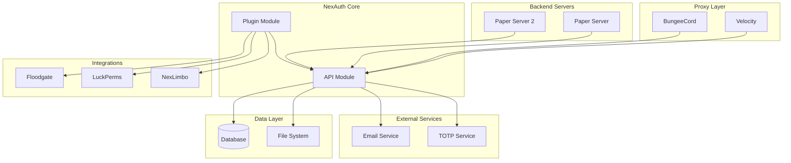
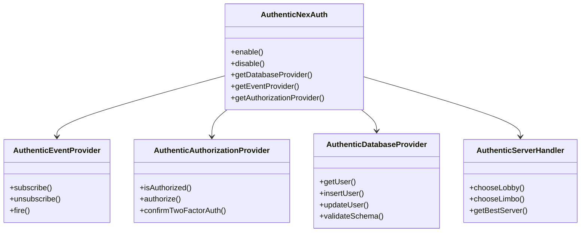
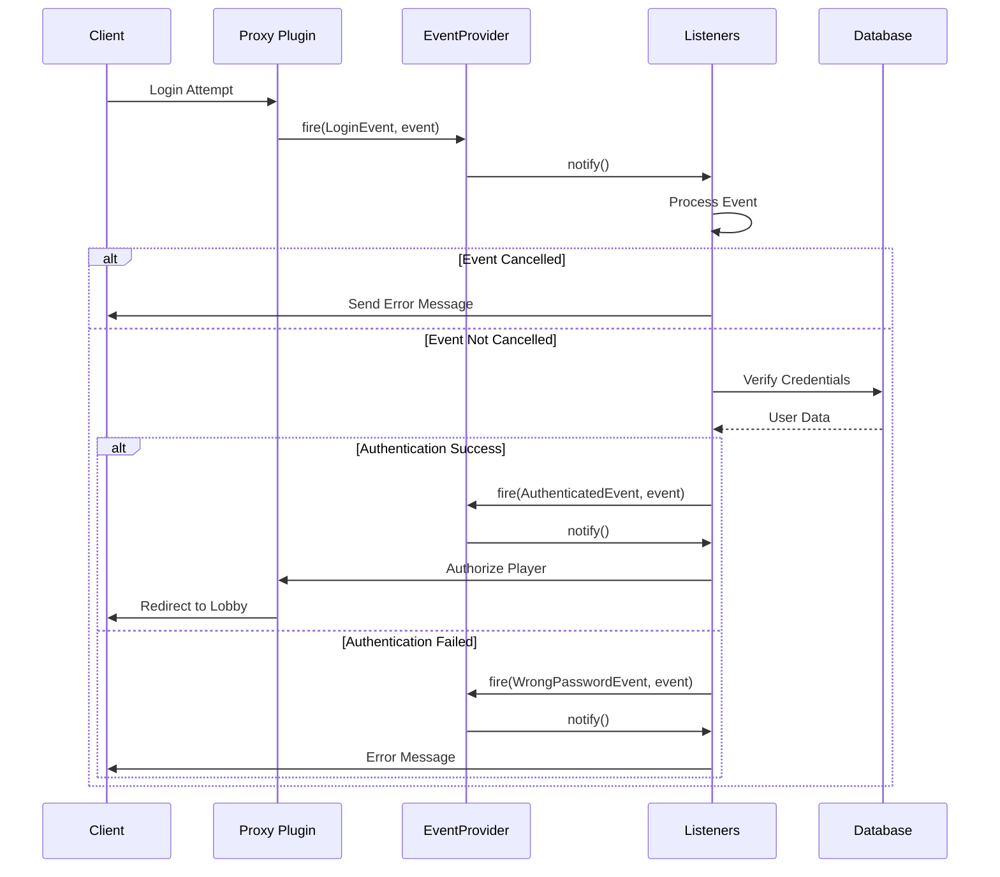
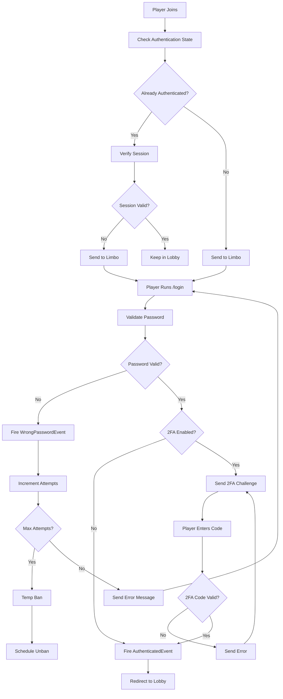
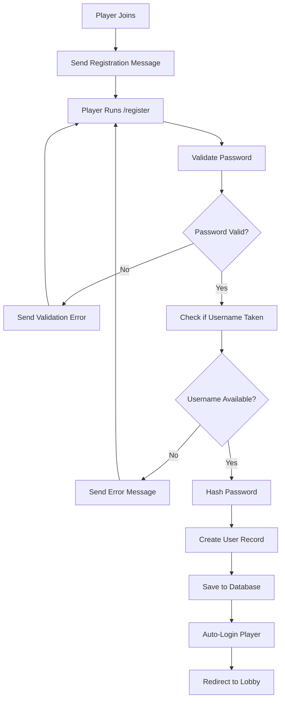

# NexAuth Architecture Documentation

## Table of Contents

1. [System Overview](#system-overview)
2. [Architecture Diagrams](#architecture-diagrams)
3. [Module Structure](#module-structure)
4. [Core Components](#core-components)
5. [Design Patterns](#design-patterns)
6. [Data Flow](#data-flow)
7. [Database Design](#database-design)
8. [Security Architecture](#security-architecture)

## System Overview

NexAuth is a modular Minecraft authentication plugin designed with a clean architecture that separates concerns between API interfaces and implementation. The system follows enterprise-grade patterns to ensure maintainability, scalability, and extensibility.

### Key Architectural Principles

- **Modularity**: Clear separation between API and implementation layers
- **Extensibility**: Plugin architecture allows easy extension
- **Security First**: Multiple layers of security and validation
- **Cross-Platform**: Support for Velocity, BungeeCord, and Paper
- **Database Agnostic**: Support for multiple database backends

## Architecture Diagrams

### System Architecture



### Plugin Module Architecture



### Event System Flow



### Database Provider Architecture

```mermaid
graph LR
    subgraph "Abstraction Layer"
        IRead[ReadDatabaseProvider]
        IWrite[WriteDatabaseProvider]
        IRW[ReadWriteDatabaseProvider]
    end

    subgraph "Concrete Providers"
        MySQL[MySQL Provider]
        PostgreSQL[PostgreSQL Provider]
        SQLite[SQLite Provider]
    end

    subgraph "Migration Providers"
        AuthMe[AuthMe Migrator]
        FastLogin[FastLogin Migrator]
        LogIt[LogIt Migrator]
    end

    IRead <|.. MySQL
    IRead <|.. PostgreSQL
    IRead <|.. SQLite
    IRead <|.. AuthMe
    IRead <|.. FastLogin
    IRead <|.. LogIt

    IWrite <|.. MySQL
    IWrite <|.. PostgreSQL
    IWrite <|.. SQLite

    IRW --|> IRead
    IRW --|> IWrite

    MySQL --> MySQL[(MySQL Database)]
    PostgreSQL --> PostgreSQL[(PostgreSQL Database)]
    SQLite --> SQLite[(SQLite Database)]
```

## Module Structure

### API Module (`/API`)

The API module defines all interfaces and abstractions:

```
API/src/main/java/xyz/xreatlabs/nexauth/api/
├── event/                    # Event system interfaces
│   ├── Event.java
│   ├── EventProvider.java
│   ├── EventType.java
│   └── events/              # Concrete event classes
├── database/                # Database abstractions
│   ├── User.java
│   ├── ReadDatabaseProvider.java
│   ├── WriteDatabaseProvider.java
│   └── connector/           # Database connectors
├── authorization/           # Authorization interfaces
│   └── AuthorizationProvider.java
├── crypto/                  # Cryptographic interfaces
│   ├── CryptoProvider.java
│   └── HashedPassword.java
├── configuration/           # Configuration interfaces
│   ├── Messages.java
│   └── CorruptedConfigurationException.java
├── server/                  # Server management
│   ├── ServerHandler.java
│   └── ServerPing.java
└── provider/                # Provider access
    └── NexAuthProvider.java
```

### Plugin Module (`/Plugin`)

The Plugin module provides concrete implementations:

```
Plugin/src/main/java/xyz/xreatlabs/nexauth/
├── common/                      # Shared implementation
│   ├── AuthenticNexAuth.java
│   ├── AuthenticHandler.java
│   ├── authorization/
│   │   └── AuthenticAuthorizationProvider.java
│   ├── database/
│   │   ├── provider/            # Concrete database providers
│   │   └── connector/           # Database connector implementations
│   ├── config/                  # Configuration system
│   │   ├── HoconPluginConfiguration.java
│   │   ├── HoconMessages.java
│   │   ├── ConfigurationKeys.java
│   │   └── migrate/             # Configuration migration
│   ├── command/                 # Command system
│   │   ├── commands/
│   │   │   ├── authorization/
│   │   │   ├── tfa/
│   │   │   ├── mail/
│   │   │   ├── premium/
│   │   │   └── staff/
│   │   └── CommandProvider.java
│   ├── crypto/                  # Crypto implementations
│   │   ├── Argon2IDCryptoProvider.java
│   │   ├── BCrypt2ACryptoProvider.java
│   │   └── LogITMessageDigestCryptoProvider.java
│   ├── mail/                    # Email system
│   ├── totp/                    # TOTP/2FA system
│   ├── image/                   # QR code generation
│   └── listener/                # Event listeners
├── bungeecord/                  # BungeeCord implementation
│   ├── BungeeCordPlatformHandle.java
│   ├── BungeeCordBootstrap.java
│   └── BungeeCordListener.java
└── velocity/                    # Velocity implementation (if present)
```

## Core Components

### 1. Event System (`event/`)

**Purpose**: Implements Observer pattern for loose coupling

**Key Components**:
- `EventProvider`: Manages event subscription, unsubscription, and firing
- `EventType`: Typed event identifiers
- `Event`: Base event interface with plugin and platform access

**Design Pattern**: Observer Pattern

**Usage Example**:
```java
// Subscribe to authentication events
Consumer<AuthenticatedEvent> handler = event -> {
    if (event.getReason() == AuthenticationReason.LOGIN) {
        // Handle successful login
    }
};
eventProvider.subscribe(eventProvider.getTypes().authenticated(), handler);

// Fire custom event
var event = new AuthenticatedEvent(plugin, player, user, reason);
eventProvider.fire(eventProvider.getTypes().authenticated(), event);
```

### 2. Database System (`database/`)

**Purpose**: Provides database abstraction with pluggable providers

**Key Components**:
- `ReadDatabaseProvider`: Read-only database operations
- `WriteDatabaseProvider`: Write operations
- `ReadWriteDatabaseProvider`: Combined interface
- `User`: User entity representation

**Design Pattern**: Strategy Pattern + Repository Pattern

**Supported Databases**:
- MySQL
- PostgreSQL
- SQLite

**Migration Support**:
- AuthMe
- FastLogin
- LogIt
- Aegis
- DBA
- JPremium
- NLogin
- LimboAuth
- Authy
- LoginSecurity
- UniqueCodeAuth
- CrazyLogin (planned)

**Usage Example**:
```java
// Register custom database provider
plugin.registerReadProvider(new ReadDatabaseProviderRegistration<>(
    connector -> new CustomDatabaseProvider(connector, plugin),
    "custom-provider",
    CustomDatabaseConnector.class
));

// Use database provider
var user = databaseProvider.getByUUID(playerUUID);
if (user != null) {
    databaseProvider.updateUser(user);
}
```

### 3. Authorization System (`authorization/`)

**Purpose**: Manages player authentication state

**Key Components**:
- `AuthorizationProvider`: Core authorization interface
- Tracks login state
- Handles 2FA confirmation
- Manages session tokens

**Design Pattern**: State Pattern

**Authentication Flow**:
1. Player joins server
2. Player redirected to limbo server
3. Player executes `/login <password>`
4. Credentials verified against database
5. If 2FA enabled, challenge issued
6. Upon success, player authorized and redirected to lobby

### 4. Crypto System (`crypto/`)

**Purpose**: Provides pluggable password hashing algorithms

**Key Components**:
- `CryptoProvider`: Interface for hash algorithms
- `HashedPassword`: Password representation

**Supported Algorithms**:
- Argon2ID (recommended)
- BCrypt2A
- SHA-256
- SHA-512
- LOGIT-SHA-256

**Security Level**:
- Argon2ID: **Highest** (memory-hard, GPU resistant)
- BCrypt2A: **High** (time-cost adjustable)
- SHA-256/SHA-512: **Low** (use only for legacy migration)

**Usage Example**:
```java
// Create hash
var cryptoProvider = plugin.getCryptoProvider("argon2id");
var hashedPassword = cryptoProvider.createHash(password);

// Verify password
var isValid = cryptoProvider.matches(inputPassword, hashedPassword);
```

### 5. Configuration System (`config/`)

**Purpose**: Manages plugin configuration with HOCON format

**Key Components**:
- `HoconPluginConfiguration`: Configuration management
- `HoconMessages`: Message localization
- `ConfigurationKeys`: Type-safe configuration keys
- `ConfigurationMigrator`: Version migration support

**Features**:
- Type-safe configuration access
- Automatic default value injection
- Version migration support
- Configuration validation
- Error recovery

**Usage Example**:
```java
// Get configuration value
var enabled = configuration.get(MAIL_ENABLED);
var maxRetries = configuration.get(MAX_LOGIN_ATTEMPTS);

// Set configuration value
configuration.set(MAIL_ENABLED, true);
configuration.save();
```

### 6. Command System (`command/`)

**Purpose**: Provides command framework based on ACF (Aikar Command Framework)

**Key Features**:
- Automatic tab completion
- Permission checking
- Argument validation
- Async execution
- Internationalization support

**Command Structure**:
```
/nexauth
├── /login <password>
├── /register <password> <confirm>
├── /changepassword <old> <new>
├── /2fa
│   ├── /2fa enable
│   └── /2fa confirm <code>
├── /premium
│   ├── /premium enable
│   └── /premium confirm <code>
├── /mail
│   ├── /mail set <email>
│   ├── /mail reset <email>
│   └── /mail verify <code>
└── /nexauth reload
```

### 7. Server Management (`server/`)

**Purpose**: Manages player server routing based on authentication state

**Features**:
- Automatic limbo server selection
- Best lobby server selection
- MultiProxy support
- Server ping and health checks

**Design Pattern**: Strategy Pattern

### 8. Premium System (`premium/`)

**Purpose**: Handles Mojang premium account integration

**Features**:
- Auto-login for premium players
- Premium UUID migration
- Offline mode support
- Premium verification throttling

## Design Patterns

### 1. Strategy Pattern

**Usage**: Database providers, crypto providers, server handlers

**Benefits**:
- Easy to add new implementations
- Runtime selection
- Loose coupling

**Example**:
```java
public interface ReadDatabaseProvider {
    User getByUUID(UUID uuid);
    User getByName(String name);
    List<User> getAllUsers();
}
```

### 2. Observer Pattern

**Usage**: Event system

**Benefits**:
- Loose coupling between components
- Easy to add/remove listeners
- Extensible event handling

**Example**:
```java
public interface EventProvider<P, S> {
    <E extends Event<P, S>> Consumer<E> subscribe(EventType<P, S, E> type, Consumer<E> handler);
    <E extends Event<P, S>> void fire(EventType<P, S, E> type, E event);
}
```

### 3. Factory Pattern

**Usage**: Database provider creation, user creation

**Benefits**:
- Centralized object creation
- Parameterized creation
- Implementation hiding

### 4. Builder Pattern

**Usage**: Configuration building, HashedPassword creation

**Benefits**:
- Fluent API
- Immutable objects
- Clear intent

### 5. Template Method Pattern

**Usage**: Database operations, event handling

**Benefits**:
- Code reuse
- Controlled extension points
- Algorithm skeleton definition

### 6. Facade Pattern

**Usage**: AuthenticNexAuth as facade for all subsystems

**Benefits**:
- Simplified API
- Hides subsystem complexity
- Single entry point

## Data Flow

### Authentication Flow



### Registration Flow



## Database Design

### User Table Schema

```sql
CREATE TABLE users (
    uuid VARCHAR(36) PRIMARY KEY,
    premium_uuid VARCHAR(36),
    password VARCHAR(255) NOT NULL,
    last_nickname VARCHAR(16),
    join_date TIMESTAMP,
    last_seen TIMESTAMP,
    secret VARCHAR(255),
    ip VARCHAR(45),
    last_authentication TIMESTAMP,
    last_server VARCHAR(255),
    email VARCHAR(255)
);
```

### Indexes

```sql
-- Fast UUID lookup
CREATE INDEX idx_users_uuid ON users(uuid);

-- Fast username lookup
CREATE INDEX idx_users_name ON users(last_nickname);

-- Premium UUID lookup
CREATE INDEX idx_users_premium ON users(premium_uuid);

-- Last seen tracking
CREATE INDEX idx_users_last_seen ON users(last_seen);

-- Email lookup
CREATE INDEX idx_users_email ON users(email);
```

### Database Migration

NexAuth supports automatic migration from multiple authentication plugins:

**Migration Process**:

1. **Detect Existing Plugin**: Scan for AuthMe, FastLogin, etc.
2. **Read User Data**: Extract user records from old database
3. **Transform Data**: Convert to NexAuth format
4. **Validate Records**: Check data integrity
5. **Insert Users**: Bulk insert into new database
6. **Verify Migration**: Random sampling validation

**Migration Data Mapping**:

| Plugin | UUID Column | Password Column | Last Name Column | Email Column |
|--------|-------------|-----------------|------------------|--------------|
| AuthMe | uuid | password | last_nickname | email |
| FastLogin | uuid | premium_pass | last_nickname | - |
| LogIt | uuid | password | last_nickname | email |

## Security Architecture

### Security Layers

#### 1. Network Security

- **Limbo Server**: Players isolated during authentication
- **Command Blocking**: Unauthorized commands disabled
- **Server Whitelisting**: Only allow listed servers
- **BungeeGuard Support**: Secure backend server access

#### 2. Authentication Security

**Password Security**:
- Strong hashing algorithms (Argon2ID, BCrypt2A)
- Salt generation for each password
- Forbid weak passwords via dictionary
- Minimum password length enforcement
- Password history prevention

**Two-Factor Authentication**:
- TOTP (Time-based One-Time Password) support
- QR code generation for easy setup
- Recovery codes for account recovery
- Integration with Authy, Google Authenticator

**Session Management**:
- Configurable session timeout
- Session token validation
- Remember-me functionality
- IP address tracking

#### 3. Data Security

**Database Security**:
- Prepared statements (SQL injection protection)
- Connection encryption (TLS/SSL)
- Regular password re-hashing
- Audit logging

**Configuration Security**:
- Sensitive data encryption
- Configuration file validation
- Automatic backup creation
- Version control support

#### 4. Infrastructure Security

**Proxy Integration**:
- BungeeGuard handshake validation
- UUID spoofing prevention
- Limbo server requirements
- Backend server protection

**Plugin Integration**:
- Sandboxed execution
- Permission validation
- Event cancellation support
- API access control

### Security Best Practices

1. **Always use Argon2ID** for new installations
2. **Enable 2FA** for administrative accounts
3. **Use NexLimbo** for secure authentication
4. **Enable TLS** for database connections
5. **Regular updates** to patch security vulnerabilities
6. **Monitor logs** for suspicious activity
7. **Implement rate limiting** on login attempts
8. **Secure backups** of authentication data

### Attack Prevention

| Attack Vector | Protection Mechanism |
|---------------|---------------------|
| Brute Force | Login attempt limiting, temporary bans |
| SQL Injection | Prepared statements, ORM |
| Password Cracking | Argon2ID/BCrypt, salt, pepper |
| Session Hijacking | Session tokens, IP validation |
| Replay Attacks | Time-based challenges, nonce |
| Man-in-the-Middle | TLS encryption, certificate pinning |
| Privilege Escalation | Permission system, RBAC |
| UUID Spoofing | BungeeGuard, signature validation |

## Performance Considerations

### Optimization Strategies

1. **Database Connection Pooling**
   - HikariCP for connection pooling
   - Configurable pool size
   - Connection validation

2. **Async Operations**
   - Database queries async
   - Event processing async
   - Command execution async

3. **Caching**
   - User data caching
   - Server status caching
   - Configuration caching

4. **Lazy Loading**
   - Lazy initialization of providers
   - On-demand loading of integrations

### Scalability

**Horizontal Scaling**:
- Stateless design
- Shared database
- Event-based communication

**Vertical Scaling**:
- Multi-threaded design
- Configurable thread pools
- ForkJoinPool utilization

**Performance Metrics**:
- Authentication latency < 100ms
- Database query < 50ms
- Event dispatch < 10ms

## Error Handling

### Error Categories

1. **Configuration Errors**
   - Corrupted configuration files
   - Missing required values
   - Invalid value types

2. **Database Errors**
   - Connection failures
   - Schema validation errors
   - Data integrity violations

3. **Authentication Errors**
   - Invalid credentials
   - Expired sessions
   - Rate limit exceeded

4. **System Errors**
   - Network timeouts
   - Plugin conflicts
   - Resource exhaustion

### Error Recovery

1. **Graceful Degradation**
   - Fallback mechanisms
   - Offline mode support
   - Partial functionality

2. **Automatic Retry**
   - Exponential backoff
   - Configurable retry limits
   - Circuit breaker pattern

3. **User Feedback**
   - Clear error messages
   - Actionable guidance
   - Logging and debugging info

## Extension Points

### Custom Database Providers

```java
public class CustomDatabaseProvider implements ReadDatabaseProvider {
    public CustomDatabaseProvider(DatabaseConnector<?> connector, NexAuthPlugin<P, S> plugin) {
        // Implementation
    }

    @Override
    public User getByUUID(UUID uuid) {
        // Custom implementation
    }
}
```

### Custom Event Handlers

```java
public class CustomEventHandler {
    @EventListener
    public void onAuthenticated(AuthenticatedEvent event) {
        // Custom logic on authentication
    }
}
```

### Custom Crypto Providers

```java
public class CustomCryptoProvider implements CryptoProvider {
    @Override
    public HashedPassword createHash(String password) {
        // Custom hash implementation
    }

    @Override
    public boolean matches(String input, HashedPassword password) {
        // Custom verification
    }
}
```

## Troubleshooting Guide

### Common Issues

1. **Database Connection Failures**
   - Check credentials
   - Verify network connectivity
   - Check firewall rules

2. **Authentication Not Working**
   - Verify configuration
   - Check event listeners
   - Review logs

3. **Performance Issues**
   - Monitor database queries
   - Check connection pool settings
   - Review server resources

### Debug Mode

Enable debug logging:
```yaml
# config.conf
logging {
    level = "DEBUG"
}
```

### Log Analysis

Key log patterns:
- `!! THIS IS MOST LIKELY NOT AN ERROR CAUSED BY NEXAUTH !!` - External issues
- `!! PLEASE UPDATE TO THE LATEST VERSION !!` - Outdated version
- `!! YOU ARE RUNNING A DEVELOPMENT BUILD !!` - Development version

## API Reference

For detailed API documentation, see:
- [Javadoc Documentation](../API/build/docs/javadoc/index.html)
- [Wiki Documentation](https://github.com/xreatlabs/NexAuth/wiki)

## Contributing

For contributing guidelines, see [CONTRIBUTING.md](../CONTRIBUTING.md)

## License

NexAuth is licensed under the Mozilla Public License 2.0.
See [LICENSE](../LICENSE) for details.
